# Swift 5 - 小小心得

## Swift5WhatsNew - 試用Swift 5的更新功能

## View3DModel - 讀取各種3D模型
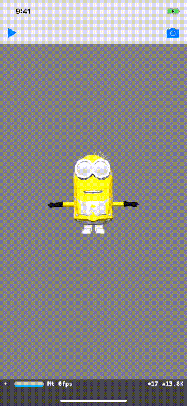

## ProximityMagic - 手機也能變撲克牌魔術？
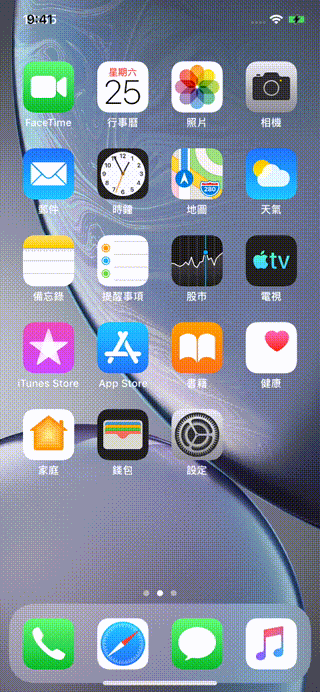

## Firebase_HelloWorld - Firebase初體驗
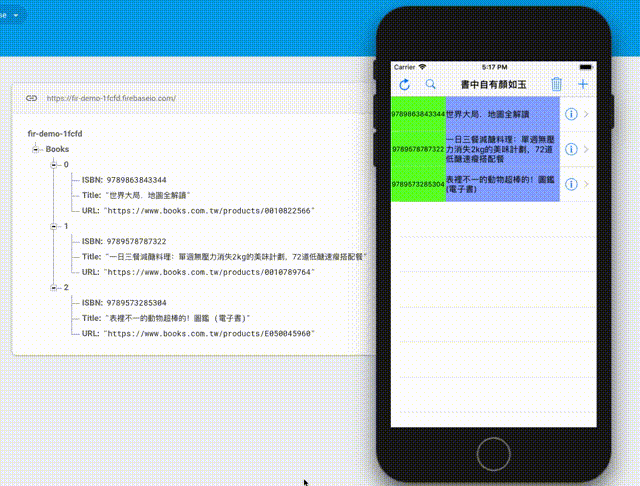

## FirebaseQuery - Firebase庫存APP

## FirebaseOrder - Firebase排序功能
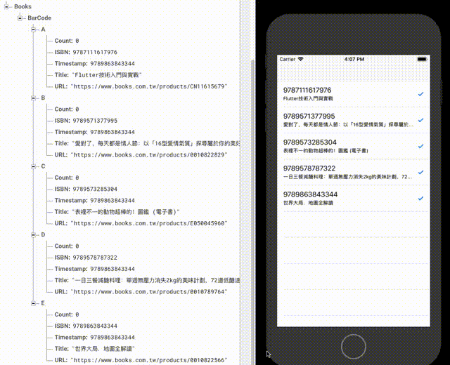

## GraphicLock - 仿Android圖形鎖
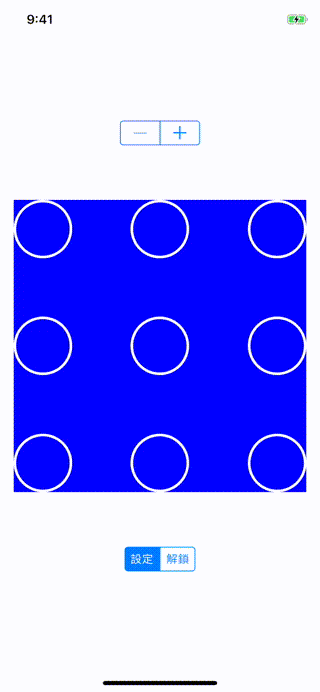

## ToNextViewController - 切換頁面的幾種方式
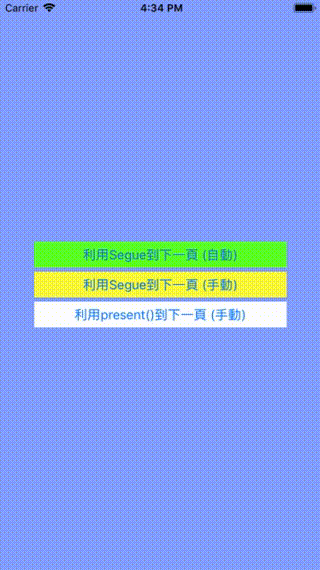

## WallpaperOfGrid - 桌面Icon分類桌布產生器
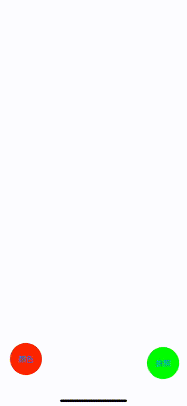

## SparkView - 按鍵火花特效

## UIContextualActionDemo - iOS11的Cell滑動選單
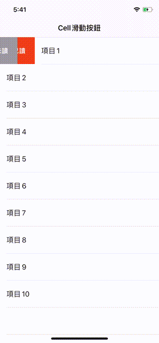

## PropertyWrapper - 屬性包裝器Demo
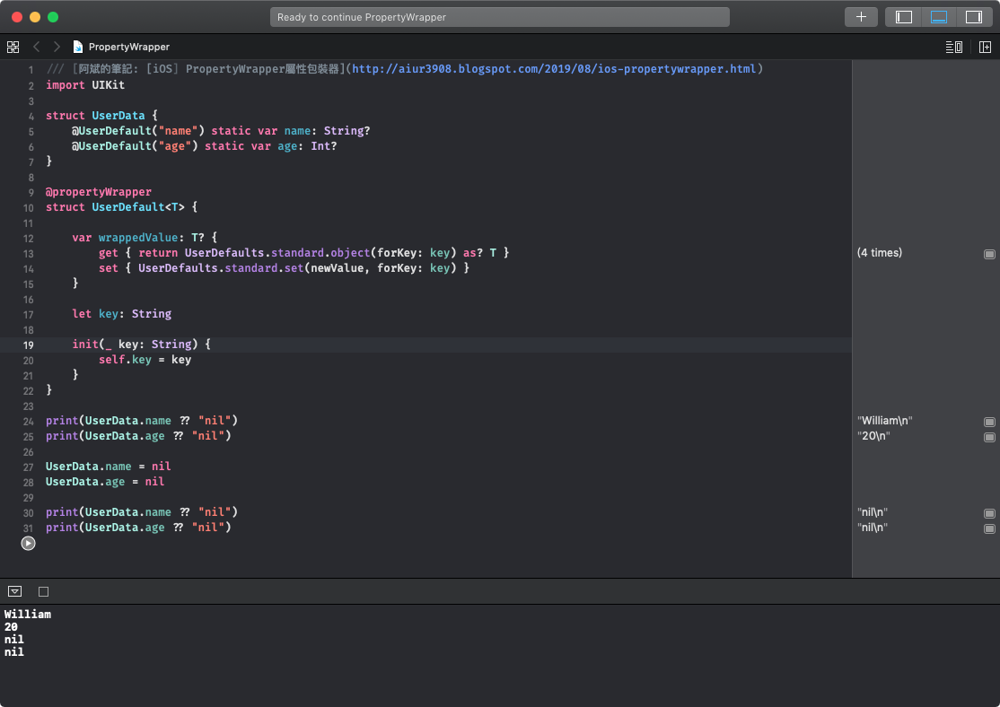

## UIPresentation_Demo - 自定義轉場動畫

## AVFoundationVideo - 前後鏡頭的應用 (錄影 / 拍照)
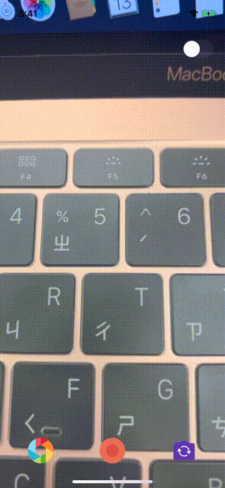

## UsingPreview - 使用SwiftUI Preview的功能
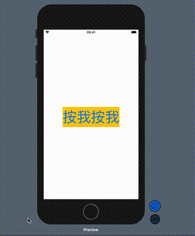

## NFC_CheckIn - NFC報到功能
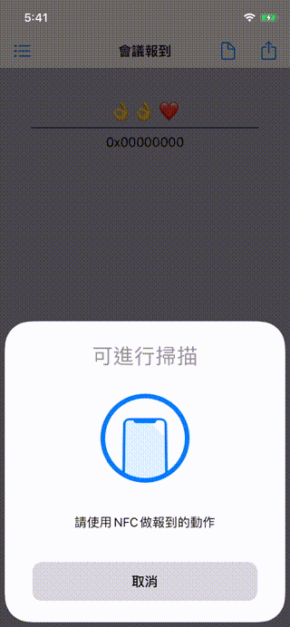

## ViewControllerLifeCycle - 測試一下生命週期的相關功能 (ViewController + View)
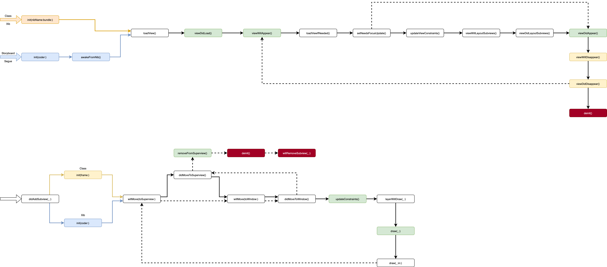

## URLSessionDemo - 了解Http基本協定的組成 (仿簡單版的Alamofire)
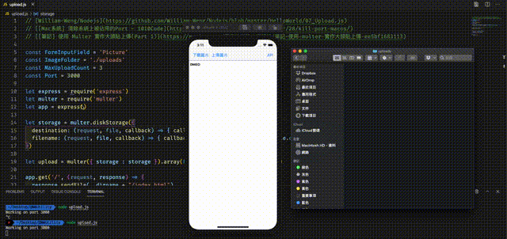

## MultipleDownload - 了解Task的使用方式 (仿Alamofire的多點下載)
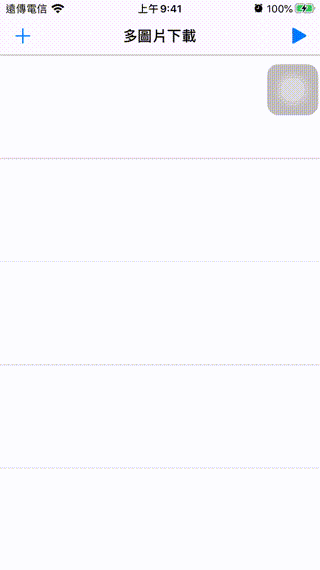

## CompositionalLayout_TableView - iOS 13 新特性
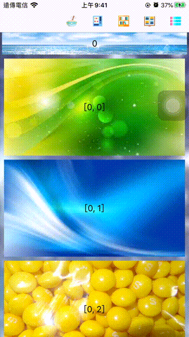

## Combine_HelloWorld - 先理解FRP的基本原理
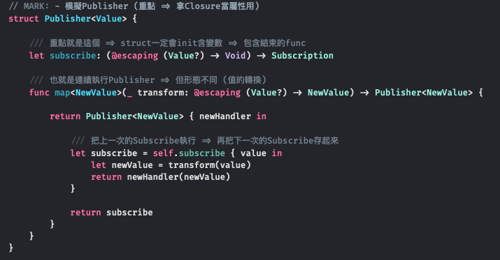

## UISplitViewController_HelloWorld - iPad程式初體驗

## AppDynamicIcons - 動態換AppIcon
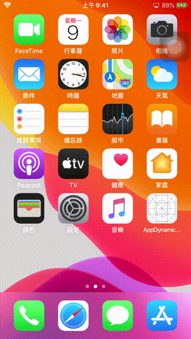

## EmitterAnimation - EmitterLayer動畫測試

## MyEnglish - WWAirTableAPI應用

## FloatingView - 會回彈的懸浮拖曳視窗

## HelloMediaPlayer - 讀取外部影片 (CFBundleDocumentTypes)
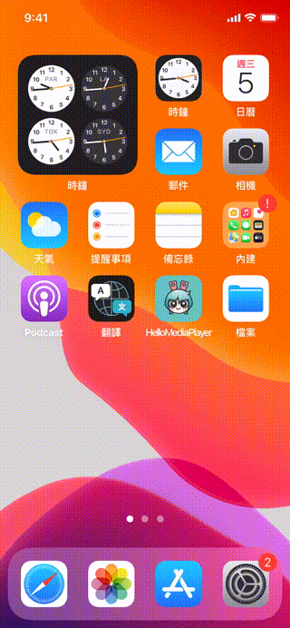

## MyLocation - 取得位置 / 語系的相關資訊
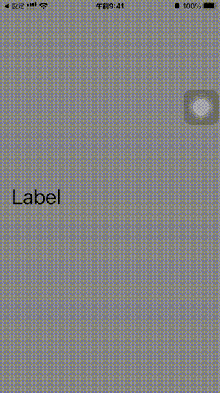

## WhatsAppToolBar - 仿WhatsApp (Tabbar <=> Toolbar)
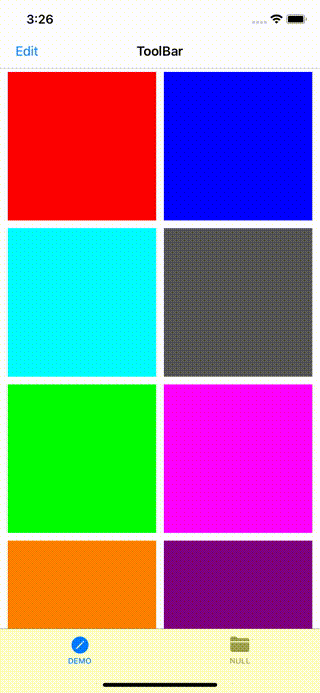

## MyTabBarController - 自訂UITabbar背景
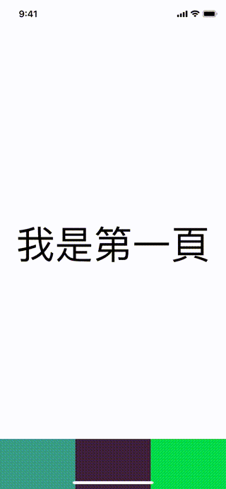

## PerpetualCalendar - 實作萬年曆
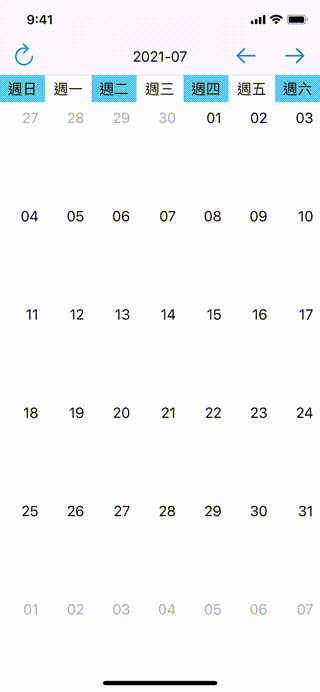
