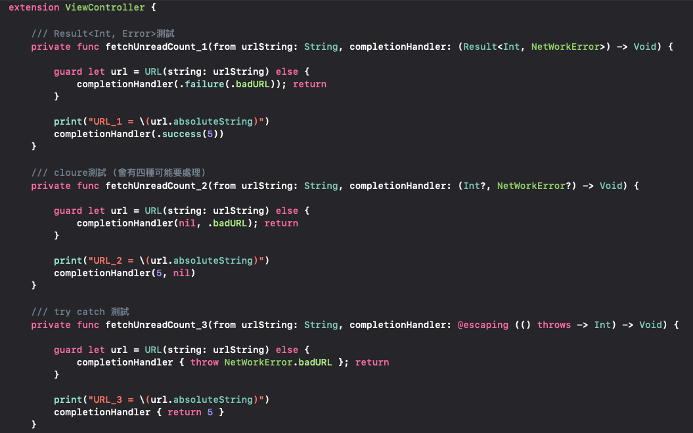
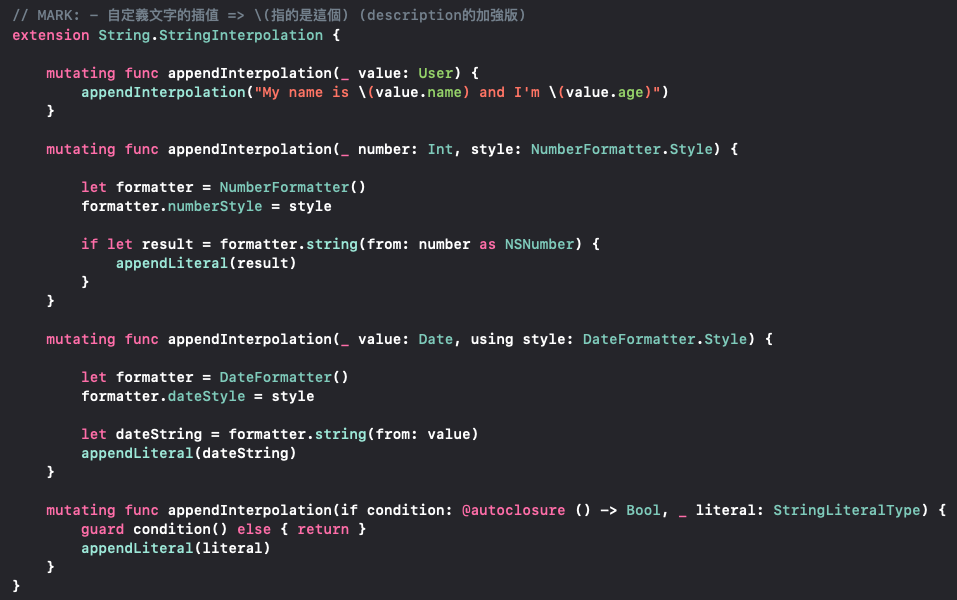
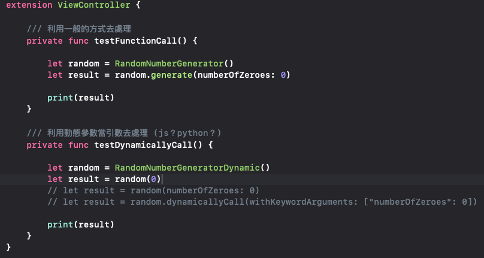
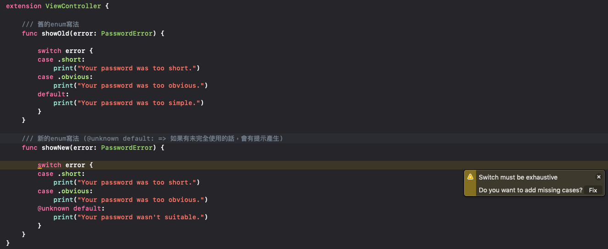
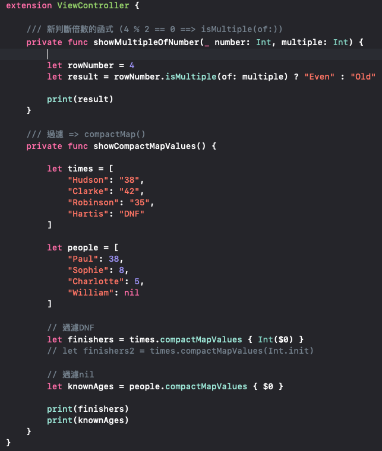

# Swift 5 What's New

## ResultDemo - 試用Swift 5的Result功能

## StringInterpolationDemo - 試用Swift 5的StringInterpolation功能

## DynamicCallableDemo - 試用@dynamicCallable功能

## FutureEnum - 試用@unknown功能

## Swift5New - Swift5其它一些新的功能

